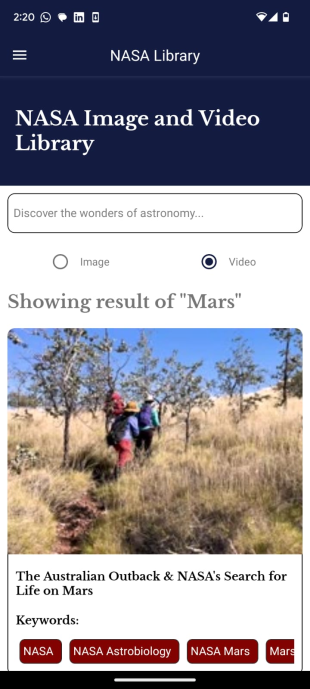
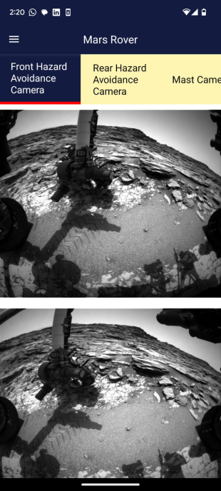
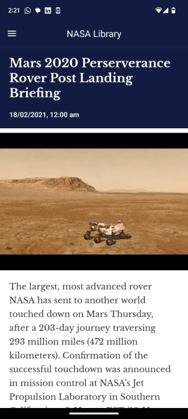
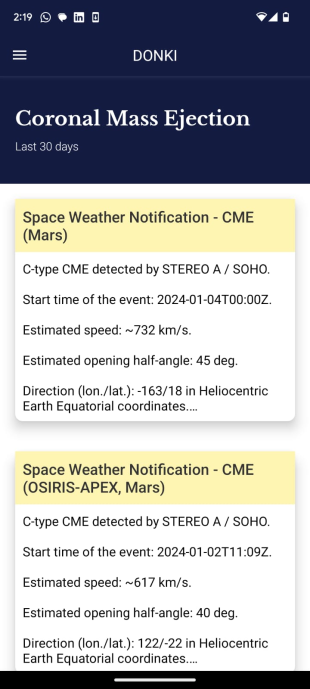
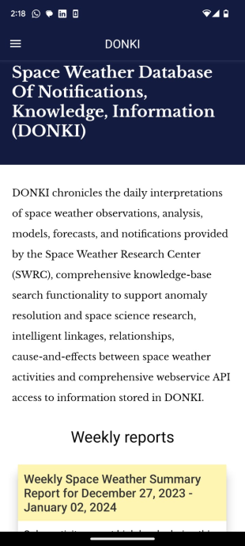
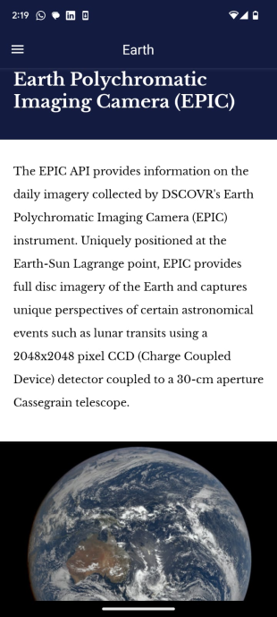

# SpaceMan
A React Native application that uses [NASA open APIs](https://api.nasa.gov/) to display information and media regarding astronomy, space and NASA's searchable database.

## Screenshots
 

 

 

# Features  
- Astronomy picture of the day - NASA uploads new media everyday with a short description
- [DONKI](https://ccmc.gsfc.nasa.gov/tools/DONKI/) - Space Weather Database Of Notifications, Knowledge, Information (DONKI). A comprehensive tool for space weather forecasters, scientists, and the general space science community. DONKI chronicles the daily interpretations of space weather observations, analysis, models, forecasts, and notifications provided by the Space Weather Research Center (SWRC). It includes informations regarding - Coronal Mass Ejections, Geomagnetic Storm, Solar Flare, Interplanetry shock etc. 
- [EPIC](http://epic.gsfc.nasa.gov/) - Provides information on the daily imagery collected by DSCOVR's Earth Polychromatic Imaging Camera (EPIC) instrument. Uniquely positioned at the Earth-Sun Lagrange point, EPIC provides full disc imagery of the Earth and captures unique perspectives of certain astronomical events such as lunar transits using a 2048x2048 pixel CCD (Charge Coupled Device) detector coupled to a 30-cm aperture Cassegrain telescope.
- Mars Rover - Designed to collect image data gathered by NASA's Curiosity rover on Mars. The app will allow user to view the photos from different camera angles on Mars Curiosity Rover. For example, Front Hazard Avoidance Camera, Mast Camera, Navigation Camera. 
- NASA Library - An open NASA library that provides images and videos of anything related to space, satellites, planets, cosmos, NASA missions etc. Feel free to explore the wonders of astronomy.     

## Dependencies
- [react-native-navigation](https://github.com/wix/react-native-navigation)
- [react-native-media-console](https://github.com/criszz77/react-native-media-console)
- [react-native-video](https://www.npmjs.com/package/react-native-video)
- [react-native-webview](https://github.com/react-native-webview/react-native-webview)
- [react-native-linking](https://reactnative.dev/docs/linking)
- [react-native-dialog](https://www.npmjs.com/package/react-native-dialog) 